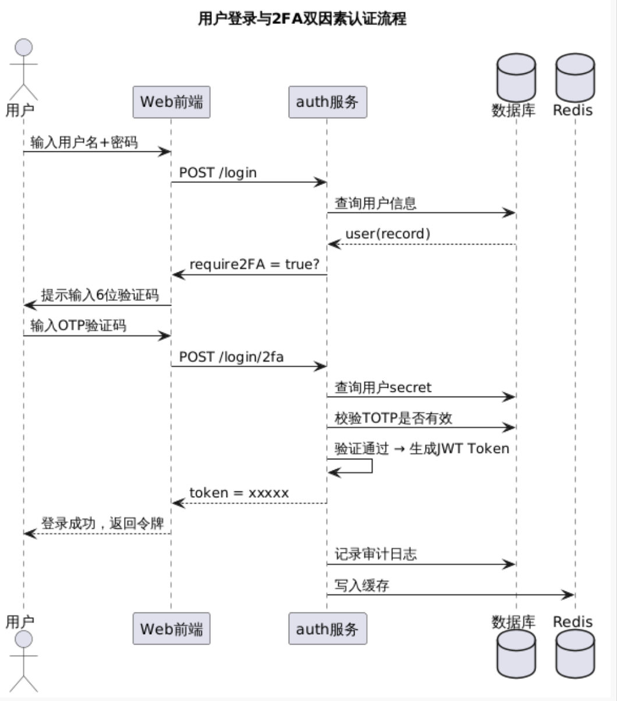

## 集成google authenticator 2FA 验证
https://github.com/wstrange/GoogleAuth

https://segmentfault.com/a/1190000043395409

https://cloud.tencent.com/developer/article/2310461
## 开源技术
https://github.com/la3rence/MFA/blob/master/src/test/java/com/auth/www/MultiFactorAuthenticatorApplicationTests.java

## 登录与2FA认证流程


1、登录成功,由服务端程序生成随机秘钥,通过二维码返回给客户端 
2、authenticator客户端扫描二维码或者手动输入秘钥进行绑定
3、应用程序使用authenticator生成的验证码请求服务端验证


## **springboot集成authenticator**


```xml
<!-- GoogleAuth -->
<dependency>
  <groupId>com.warrenstrange</groupId>
  <artifactId>googleauth</artifactId>
  <version>1.5.0</version>
</dependency>
<dependency>
  <groupId>com.google.zxing</groupId>
  <artifactId>javase</artifactId>
  <version>3.4.1</version>
</dependency>
```


## **.使用方式** 

1. 用户下载authenticator,如果已经下载可跳过
2. 使用账密登录系统,如果没有绑定过authenticator,弹出二维码
3. 使用authenticator扫描二维码进行秘钥绑定,如果已经绑定过跳过
4. 使用authenticator生成的6为数字输入到系统进行验证


## 双因素认证（2FA）登录接口设计规范

**版本：v1.0**
 **作者：架构组**
 **适用范围：Spring Boot Auth 模块**
 **认证方式：用户名+密码 + Google Authenticator (TOTP)**


## 一、设计背景

为增强系统账户安全性，防止凭证泄露导致的未授权访问，系统在传统的用户名+密码基础上，引入 **双因素认证（2FA）机制**。

用户需在输入正确密码后，再输入由 Google Authenticator 生成的 6 位动态验证码完成登录认证。


## 二、核心流程说明

### 🔐 登录流程概述

```txt
Step 1️⃣ 用户输入账号密码 → 服务端校验 → 若开启2FA → 返回临时令牌(tempToken)
Step 2️⃣ 用户输入动态验证码 → 服务端校验 → 生成JWT → 登录完成

```


## 三、接口定义

| 阶段   | 接口                   | 方法 | 说明                              |
| ------ | ---------------------- | ---- | --------------------------------- |
| 第一步 | `/api/auth/login`      | POST | 用户名密码登录，判断是否开启2FA   |
| 第二步 | `/api/auth/verify-2fa` | POST | 输入验证码验证，通过后颁发JWT令牌 |


## 四、接口详细说明

### 1️⃣ `/api/auth/login`

#### **接口描述**

验证用户名密码是否正确，若用户启用了 2FA，则返回临时登录令牌（tempToken），要求前端进入验证码输入环节。

#### **请求参数**

| 参数名   | 类型   | 是否必填 | 说明                   |
| -------- | ------ | -------- | ---------------------- |
| username | String | ✅        | 用户名                 |
| password | String | ✅        | 用户密码（需加密传输） |


#### **响应参数**

| 参数名          | 类型    | 说明                                         |
| --------------- | ------- | -------------------------------------------- |
| code            | int     | 状态码（0=成功，10001=需2FA验证，9999=失败） |
| msg             | String  | 返回消息                                     |
| data.token      | String  | 登录成功返回的JWT令牌                        |
| data.require2FA | Boolean | 是否启用双因素验证                           |
| data.tempToken  | String  | 临时登录令牌（仅在 require2FA=true 时存在）  |


#### **响应示例**

✅ 未开启2FA：

```json
{
  "code": 0,
  "msg": "登录成功",
  "data": {
    "token": "eyJhbGciOiJIUzI1NiIsInR5..."
  }
}

```

✅ 已开启2FA：

```json
{
  "code": 10001,
  "msg": "需要进行双因素认证",
  "data": {
    "require2FA": true,
    "tempToken": "temp-7e9f-uuid-43a1"
  }
}

```

❌ 登录失败：

```json
{
  "code": 9999,
  "msg": "用户名或密码错误"
}

```


### 2️⃣ `/api/auth/verify-2fa`

#### **接口描述**

用于验证用户输入的动态验证码（OTP），通过后生成正式JWT令牌。

#### **请求参数**

| 参数名    | 类型   | 是否必填 | 说明                                       |
| --------- | ------ | -------- | ------------------------------------------ |
| tempToken | String | ✅        | 登录第一步返回的临时令牌                   |
| otpCode   | String | ✅        | Google Authenticator 动态验证码（6位数字） |


请求示例

```json
POST /api/auth/verify-2fa
{
  "tempToken": "temp-7e9f-uuid-43a1",
  "otpCode": "251084"
}

```


#### **响应参数**

| 参数名        | 类型   | 说明                                                   |
| ------------- | ------ | ------------------------------------------------------ |
| code          | int    | 状态码（0=成功，10002=验证码错误，10003=临时令牌无效） |
| msg           | String | 返回消息                                               |
| data.token    | String | 登录成功后的JWT令牌                                    |
| data.userInfo | Object | 用户基本信息                                           |

#### **响应示例**

✅ 验证成功：

```json
{
  "code": 0,
  "msg": "二次验证成功",
  "data": {
    "token": "eyJhbGciOiJIUzI1NiIsInR5c...",
    "userInfo": {
      "id": 1001,
      "username": "jack"
    }
  }
}

```

❌ 验证失败：

```json
{
  "code": 10002,
  "msg": "动态验证码错误"
}

```


❌ 临时令牌过期：

```json
{
  "code": 10003,
  "msg": "登录状态已过期，请重新登录"
}

```


## 五、安全与合规要求

| 安全点       | 要求                    | 实现方式            |
| ------------ | ----------------------- | ------------------- |
| 传输加密     | 全程HTTPS               | 强制使用TLS 1.2以上 |
| 密码存储     | 不可逆加密              | BCrypt 或 Argon2    |
| Secret存储   | 对称加密保护            | AES-GCM 或 KMS      |
| 临时token    | 过期时间3~5分钟         | Redis TTL           |
| 重放攻击防御 | 验证通过后删除临时token | Redis 删除key       |
| 登录限流     | 每账号/IP限制登录频率   | Redis 限流器        |
| 审计日志     | 记录登录尝试            | DB + ELK            |
| 错误提示     | 不区分错误类型          | 返回统一错误消息    |


## 六、异常码定义

| Code  | 含义         | 说明                |
| ----- | ------------ | ------------------- |
| 0     | 成功         | 登录或验证通过      |
| 10001 | 需2FA验证    | 用户启用2FA         |
| 10002 | 验证码错误   | OTP错误或失效       |
| 10003 | 临时令牌无效 | tempToken过期或伪造 |
| 9999  | 登录失败     | 用户名/密码错误     |